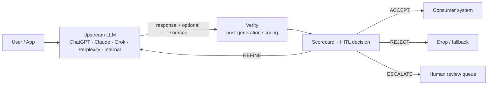

# Verity

**A confidence-scoring layer for LLM output. Sits after generation, scores every response on four dimensions, and routes it to ACCEPT / REFINE / REJECT / ESCALATE — so a human (or your app) can act on a verdict instead of guessing.**

> An LLM that is confidently wrong is more dangerous than one that is obviously wrong. Verity makes the difference visible — and routable.

[](LICENSE)
[](https://github.com/jsfaulkner86/verity/actions/workflows/ci.yml)
[](https://www.python.org/)
[](#roadmap)
[](https://github.com/psf/black)
[](https://mypy.readthedocs.io/)
[](https://fastapi.tiangolo.com/)
[](https://modelcontextprotocol.io/)
[](CONTRIBUTING.md)

---

## Table of contents

- [Why Verity?](#why-verity)
- [What it scores](#what-it-scores)
- [How it fits](#how-it-fits)
- [Quickstart](#quickstart)
- [Use cases](#use-cases)
- [Configuration](#configuration)
- [Observability & audit](#observability--audit)
- [Repository layout](#repository-layout)
- [Development](#development)
- [Roadmap](#roadmap)
- [Help wanted](#help-wanted)
- [Security & PHI posture](#security--phi-posture)
- [License](#license)

---

## Why Verity?

LLMs produce fluent prose at scale; what they don't produce is a calibrated signal that the prose is true. Today's failure mode is rarely a refusal — it's a confident answer with fabricated citations, drifted numbers, or hedging language that papers over a hallucination. Downstream systems can't act on "looks fine."

Verity replaces "looks fine" with a structured verdict:

- **Four orthogonal dimensions**, each `[0.0, 1.0]` with a rationale.
- **A composite score** weighted for your domain.
- **A routing decision** — ACCEPT, REFINE, REJECT, or ESCALATE — and, when a refinement is warranted, a concrete re-prompt aimed at the weakest dimensions.
- **An append-only audit trail** of every scorecard for review, drift detection, and compliance review.

It works with any upstream model (ChatGPT, Claude, Perplexity, Grok, an internal model) because it operates on the response, not the provider API.

---

## What it scores

| Dimension              | Question it answers                                                            | Typical signal                                |
| ---------------------- | ------------------------------------------------------------------------------ | --------------------------------------------- |
| **Source grounding**   | Does the response actually rest on the retrieval context it was given?         | Token / n-gram overlap with supplied sources  |
| **Factual consistency**| Are the verifiable claims supported by the sources?                            | Per-claim support against source spans        |
| **Claim specificity**  | How dense are high-precision (numeric, clinical, citation) claims?             | Atomic-claim taxonomy + risk weighting        |
| **Hedging calibration**| Is uncertainty language matched to the risk of each claim?                     | Hedge presence vs. claim type                 |

Each dimension produces a `DimensionScore` (`score`, `rationale`, `evidence_count`). The composite is a weighted sum; weights default to clinical-leaning (`0.35 / 0.35 / 0.15 / 0.15`) and are configurable per deployment.

---

## How it fits



Verity is **post-generation middleware**. It does not regenerate, retrieve, or guard the prompt path. Its only job is to produce a structured, auditable verdict on a response that already exists.

---

## Quickstart

```bash
# 1. Install (Python 3.11+)
pip install -e ".[dev]"

# 2. Configure
cp .env.example .env
# edit .env — set provider keys you need, adjust thresholds

# 3. Run the API
make run                       # uvicorn on http://localhost:8080
curl localhost:8080/health
```

### Score a response

```bash
curl -s localhost:8080/score \
  -H 'content-type: application/json' \
  -d '{
        "response_text": "The patient was given 200 mg of ibuprofen.",
        "sources": ["Ibuprofen 200 mg is a standard adult NSAID dose."],
        "source_model": "gpt-4o",
        "domain": "clinical"
      }' | jq
```

Response is a `ScorecardResult` with per-dimension scores, atomic claims, and an HITL recommendation including a concrete refinement prompt when the score lands in the REFINE band.

### Use the library directly

```python
from verity.core.schemas import ScoreRequest
from verity.scoring import score_response

result = score_response(ScoreRequest(
    response_text="Ibuprofen 200 mg reduces inflammation.",
    sources=["Ibuprofen 200 mg is a standard adult NSAID dose."],
    domain="clinical",
))

print(result.overall_score, result.hitl.decision)
```

### Use it from an MCP client

`.mcp.json` declares three tools — `score_response`, `extract_claims`, `get_hitl_decision` — served by `python -m verity.api.mcp_server` over stdio. The dispatcher in `verity.api.mcp_server.dispatch()` is exported for direct integration with any MCP SDK.

---

## Use cases

Verity is provider-agnostic. The same scoring pipeline runs against any response text and optional source context.

| Workflow                                                | Upstream                | What Verity adds                                                                              |
| ------------------------------------------------------- | ----------------------- | --------------------------------------------------------------------------------------------- |
| **RAG answer review**                                   | ChatGPT, Claude, Llama  | Catches answers that paraphrase but don't actually rest on the retrieved chunks               |
| **Web-search summarization**                            | Perplexity, Grok        | Flags claims that drift from cited URLs; routes low-grounding answers to REFINE               |
| **Clinical Q&A / decision support**                     | any                     | ESCALATEs anything carrying PHI; tightens accept threshold; surfaces unhedged numeric claims  |
| **Internal copilots over private docs**                 | any                     | Audit log of every accepted answer; rationale per dimension for review and drift detection    |
| **Agent self-check before tool use**                    | any                     | Cheap, deterministic verdict the agent can branch on before taking an irreversible action     |
| **Eval pipelines and offline grading**                  | any                     | Reproducible per-dimension scores you can diff across model versions                          |

Walkthroughs for each are in [`docs/USE_CASES.md`](docs/USE_CASES.md).

---

## Configuration

All runtime knobs are environment variables (see `.env.example`). Important ones:

| Var                            | Default               | Purpose                                                |
| ------------------------------ | --------------------- | ------------------------------------------------------ |
| `VERITY_ACCEPT_THRESHOLD`      | `0.80`                | `overall >= this` → ACCEPT                             |
| `VERITY_REFINE_THRESHOLD`      | `0.55`                | `overall < this` → REJECT; between → REFINE            |
| `VERITY_HEALTHCARE_MODE`       | `true`                | Treat PHI flag as automatic ESCALATE                   |
| `VERITY_PHI_DETECTION`         | `true`                | Run PHI/PII pattern detection on responses             |
| `VERITY_AUDIT_LOG_PATH`        | `./logs/audit.jsonl`  | Append-only JSONL audit sink                           |
| `VERITY_AUDIT_RETENTION_DAYS`  | `90`                  | Advisory retention (rotation handled externally)       |

Thresholds are validated: `refine_threshold` must be strictly less than `accept_threshold`.

---

## Observability & audit

- **Structured logs** via `structlog`. Console renderer in dev, JSON otherwise. A global processor redacts PHI/PII from every string field before render — callers cannot accidentally log raw prompts.
- **Prompt/response hashing**: `verity.observability.logging.hash_prompt` produces a stable 16-char SHA-256 prefix for correlation.
- **Append-only audit log**: every `ScorecardResult` is written as one JSON line to `VERITY_AUDIT_LOG_PATH`. Raw prompt/response text is never persisted; claim text is redacted defensively before write.
- **Optional tracing**: set `LANGSMITH_API_KEY` for LangSmith, or `OTEL_EXPORTER_OTLP_ENDPOINT` for an OpenTelemetry collector. Wiring is left to the caller — the package does not auto-export traces by default to avoid silent egress of sensitive content.

---

## Repository layout

```
verity/
├── config.py              # pydantic-settings; thresholds, keys, paths
├── core/
│   └── schemas.py         # Claim, DimensionScore, ScorecardResult, HITL*
├── claims/
│   └── extractor.py       # deterministic, LLM-free atomic-claim extractor
├── scoring/
│   ├── dimensions.py      # four dimension scorers
│   └── engine.py          # composite + audit-write + HITL routing
├── hitl/
│   └── router.py          # ACCEPT / REFINE / REJECT / ESCALATE rules
├── observability/
│   ├── logging.py         # structlog config with PHI redaction
│   ├── phi.py             # detection + redaction primitives
│   └── audit.py           # append-only JSONL audit logger
├── api/
│   ├── main.py            # FastAPI: /health /version /score /claims /hitl
│   └── mcp_server.py      # MCP stdio server + dispatch()
└── adapters/              # provider adapter stubs (OpenAI, Anthropic, …)
tests/                     # pytest suite
docs/                      # ARCHITECTURE.md, SECURITY.md, USE_CASES.md
```

---

## Development

```bash
make dev            # install with dev + langsmith extras
make test           # pytest
make test-cov       # pytest + coverage
make lint           # ruff
make format         # black
make typecheck      # mypy --strict
make docker-build   # build container image
make docker-run     # docker compose up
```

Tests are deterministic and self-contained — they use a tmp-path audit log via `tests/conftest.py` and never touch the network.

---

## Roadmap

Post-0.1 priorities, roughly in order:

- [ ] LLM-backed claim extractor behind the same `extract_claims` contract
- [ ] Per-domain weight profiles (clinical vs. legal vs. financial vs. general)
- [ ] HITL escalation queue integration (webhook + dead-letter)
- [ ] OpenTelemetry span auto-export with content-aware sampling
- [ ] Provider adapters: stream wrappers for OpenAI, Anthropic, Perplexity, xAI
- [ ] Eval harness with public scorecards across reference RAG datasets
- [ ] Per-tenant threshold overrides + signed audit-log export

---

## Help wanted

Verity is small on purpose; the easiest way to contribute is to extend one of the well-defined seams.

| Area                          | What we'd love                                                                                  | Pointer                                            |
| ----------------------------- | ----------------------------------------------------------------------------------------------- | -------------------------------------------------- |
| **Provider adapters**         | Stream wrappers for OpenAI, Anthropic, Perplexity, xAI / Grok, Mistral, Bedrock, Vertex         | `verity/adapters/`                                 |
| **New scoring dimensions**    | E.g. citation resolvability, temporal coherence, prompt-injection signal                        | `verity/scoring/dimensions.py`                     |
| **Domain weight profiles**    | Tuned defaults for legal, financial, customer support                                           | `verity/scoring/engine.py`                         |
| **Examples**                  | End-to-end notebooks: RAG over your stack, Perplexity reranking, agent self-check               | `docs/USE_CASES.md`                                |
| **HITL queue backends**       | Webhook target, Slack/Teams notifier, dead-letter to S3/Kafka                                   | `verity/hitl/`                                     |
| **Eval datasets & harness**   | Reproducible scorecards across public RAG benchmarks                                            | new under `tests/eval/`                            |

See [`CONTRIBUTING.md`](CONTRIBUTING.md) for the dev loop, scope guardrails, and how to claim a "good first issue."

---

## Security & PHI posture

Verity ships PHI-safe defaults:

- Structured logs redact obvious PHI/PII patterns globally.
- Raw prompt/response text is hashed (not stored) for correlation.
- The audit log contains only the scorecard and (redacted) claim text — never raw responses.
- PHI flagged in a clinical context routes to ESCALATE regardless of composite score.

**Verity is not a HIPAA-grade de-identification pipeline.** PHI detection is conservative pattern matching and will miss free-text, indirect, and quasi-identifiers. Run it behind an authenticated gateway in any non-development deployment.

See [`docs/SECURITY.md`](docs/SECURITY.md) for the full threat model and [`docs/ARCHITECTURE.md`](docs/ARCHITECTURE.md) for the scoring pipeline in detail.

---

## License

MIT. See [`LICENSE`](LICENSE). Contributions are accepted under the same terms.
