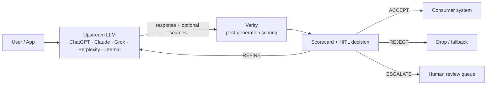

# Verity — Architecture

## Position in the stack



Verity is **post-generation** middleware. It does not regenerate, retrieve,
or guard the prompt path. Its sole job is to produce a structured,
auditable verdict on a response that already exists. The top-level flow
matches the README diagram so the first-click and second-click views stay
aligned.

## Inside Verity

```mermaid
flowchart LR
    Req[ScoreRequest] --> Extract["extract_claims<br/>verity.claims.extractor"]
    Extract --> Claims[list[Claim]]

    Req --> Grounding["score_source_grounding<br/>verity.scoring.dimensions"]
    Claims --> Factual["score_factual_consistency<br/>verity.scoring.dimensions"]
    Req --> Factual
    Claims --> Specificity["score_claim_specificity<br/>verity.scoring.dimensions"]
    Claims --> Hedging["score_hedging_calibration<br/>verity.scoring.dimensions"]

    Grounding --> Composite["weighted composite<br/>verity.scoring.engine"]
    Factual --> Composite
    Specificity --> Composite
    Hedging --> Composite

    Composite --> Decide["decide<br/>verity.hitl.router"]
    Claims --> Decide
    Decide --> Result[ScorecardResult]
    Result --> Audit["audit write<br/>verity.observability.audit"]
```

The internal scoring path is pure and deterministic at v0. `ScoreRequest`
enters `verity.scoring.engine.score_response`, claims are extracted by
`verity.claims.extractor`, four dimension scorers run from
`verity.scoring.dimensions`, the weighted composite is calculated in
`verity.scoring.engine`, routing happens in `verity.hitl.router`, and the
result can be written by `verity.observability.audit`.

The four scorers are designed to be drop-in replaceable: any future
LLM-backed scorer can implement the same `(...) -> DimensionScore`
signature and slot in behind a feature flag without touching the public
scorecard schema.

## Composite weights

Defaults are clinical-leaning:

| Dimension              | Weight |
| ---------------------- | ------ |
| Source grounding       | 0.35   |
| Factual consistency    | 0.35   |
| Claim specificity      | 0.15   |
| Hedging calibration    | 0.15   |

Per-domain weight profiles are planned for v0.2; the weights live in
`verity/scoring/engine.py` as a module-level dict for now.

## HITL routing

Rules, in priority order:

1. **PHI flagged + clinical context** → `ESCALATE` (human review).
2. `overall < refine_threshold` → `REJECT`.
3. `overall < accept_threshold` → `REFINE` (with concrete re-prompt).
4. Otherwise → `ACCEPT`.

The REFINE re-prompt is constructed from:
- the two weakest dimensions, and
- up to three unhedged high-specificity claims (numeric, clinical,
  citation).

## PHI / PII handling

Two layers:

1. **Detection** (`verity.observability.phi.detect_phi`): pattern-based
   match for SSN, phone, email, DOB, MRN, and long numeric IDs. Conservative
   by design — false positives are preferable to misses.
2. **Redaction** (`redact_phi`): every matched substring is replaced with
   a `[REDACTED:<LABEL>]` placeholder.

Both are wired into the logging layer (`_redact_processor` in
`logging.py`) so any string field passed to `structlog` is redacted
before render. The audit logger also defensively redacts claim text
before writing.

**Verity is not a HIPAA-grade de-identification pipeline.** It is the
safe-by-default lower bound on what `verity` itself emits.

## Audit log

`logs/audit.jsonl` is append-only, one `ScorecardResult` per line.
Raw prompt and response text are NEVER written to the audit log — only
the extracted (and redacted) claim text. The retention policy
(`VERITY_AUDIT_RETENTION_DAYS`) is advisory; rotation is delegated to
the operator (logrotate, cron, or a sidecar).

## Threading and async

Scoring is CPU-light and synchronous. The FastAPI endpoints are
declared synchronously so they can be served on either a sync or async
worker. The audit logger uses a process-local lock for write safety
within a single uvicorn worker; multi-worker deployments should use a
shared sink (Kafka, S3, etc.) — not a shared file.

## Extensibility hooks

| Concern                | Where to extend                              |
| ---------------------- | -------------------------------------------- |
| New dimension          | Add scorer to `scoring/dimensions.py`, add to weights, list in engine |
| LLM-backed extractor   | Replace `verity.claims.extractor.extract_claims` |
| New HITL decision      | Add to `core.schemas.HITLDecision`, route in `hitl/router.py` |
| Provider adapter       | Drop a module into `verity/adapters/`        |
| Tracing exporter       | Hook into `observability/logging.py` processors |
